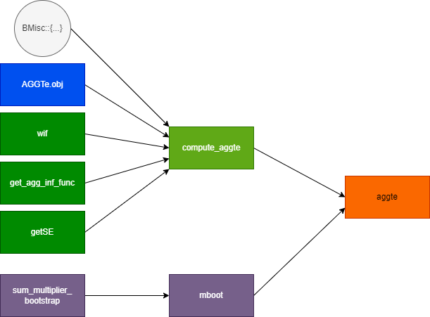
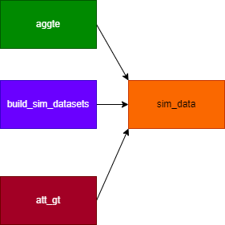

# Library Creation Process

## `agg_te`

## `agg_gt`

### `DRDID` package

[DRDID](https://github.com/pedrohcgs/DRDID/tree/master)

To Build o adapt:

- `std_ipw_did_panel`:
  - [R file](https://github.com/pedrohcgs/DRDID/blob/master/R/std_ipw_did_rc.R)
- `reg_did_panel`:
  - [R file](https://github.com/pedrohcgs/DRDID/blob/master/R/reg_did_panel.R)
  - [Python `Difference` package](https://github.com/bernardodionisi/differences/blob/main/differences/did/did_cal.py)
- `drdid_panel`:
  - [R file](https://github.com/pedrohcgs/DRDID/blob/master/R/drdid_panel.R)
  - [Python `Difference` package](https://github.com/bernardodionisi/differences/blob/main/differences/did/did_cal.py)
- `std_ipw_did_rc`:
  - [R file](https://github.com/pedrohcgs/DRDID/blob/master/R/std_ipw_did_rc.R)
  - [Python `Difference` package](https://github.com/bernardodionisi/differences/blob/main/differences/did/did_cal.py)
- `reg_did_rc`:
  - [R file](https://github.com/pedrohcgs/DRDID/blob/master/R/reg_did_rc.R)
  - [Python `Difference` package](https://github.com/bernardodionisi/differences/blob/main/differences/did/did_cal.py)
- `drdid_rc`:
  - [R file](https://github.com/pedrohcgs/DRDID/blob/master/R/drdid.R)
  - [Python `Difference` package](https://github.com/bernardodionisi/differences/blob/main/differences/did/did_cal.py)

## `simulate data`

