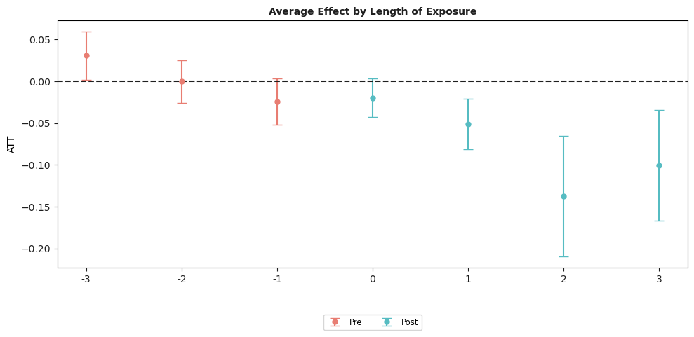

# Difference in Difference in Python

[](https://pypi.org/project/csdid/)
[](https://pepy.tech/project/csdid)
[](https://github.com/d2cml-ai/csdid/commits/main)
[](https://github.com/d2cml-ai/csdid/stargazers)
[](https://github.com/d2cml-ai/csdid/issues)
[](https://github.com/d2cml-ai/csdid/blob/main/LICENSE)


The **csdid** package contains tools for computing average treatment
effect parameters in a Difference-in-Differences setup allowing for

- More than two time periods

- Variation in treatment timing (i.e., units can become treated at
  different points in time)

- Treatment effect heterogeneity (i.e, the effect of participating in
  the treatment can vary across units and exhibit potentially complex
  dynamics, selection into treatment, or time effects)

- The parallel trends assumption holds only after conditioning on
  covariates

The main parameters are **group-time average treatment effects**. These
are the average treatment effect for a particular group (group is
defined by treatment timing) in a particular time period. These
parameters are a natural generalization of the average treatment effect
on the treated (ATT) which is identified in the textbook case with two
periods and two groups to the case with multiple periods.

Group-time average treatment effects are also natural building blocks
for more aggregated treatment effect parameters such as overall
treatment effects or event-study-type estimands.

## Getting Started

There has been some recent work on DiD with multiple time periods. The
**csdid** package implements the framework put forward in

- [Callaway, Brantly and Pedro H.C. Sant’Anna.
  “Difference-in-Differences with Multiple Time Periods.” Journal of
  Econometrics, Vol. 225, No. 2, pp. 200-230,
  2021.](https://doi.org/10.1016/j.jeconom.2020.12.001) or
  \[arXiv\](https://arxiv.org/abs/1803.09015

This project is based on the original [did R
package](https://github.com/bcallaway11/did).

## Instalation

You can install **csdid** from `pypi` with:

    pip install csdid

or via github:

    pip install git+https://github.com/d2cml-ai/csdid/

### Dependencies

Additionally, I have created an additional library called `drdid`, which
can be installed via GitHub.

    pip install git+https://github.com/d2cml-ai/DRDID

## Basic Example

The following is a simplified example of the effect of states increasing
their minimum wages on county-level teen employment rates which comes
from [Callaway and Sant’Anna
(2021)](https://authors.elsevier.com/a/1cFzc15Dji4pnC).

- [More detailed examples are also
  available](https://bcallaway11.github.io/did/articles/did-basics.html)

A subset of the data is available in the package and can be loaded by

``` python
from csdid.att_gt import ATTgt
import pandas as pd
data = pd.read_csv("https://raw.githubusercontent.com/d2cml-ai/csdid/function-aggte/data/mpdta.csv")
```

The dataset contains 500 observations of county-level teen employment
rates from 2003-2007. Some states are first treated in 2004, some in
2006, and some in 2007 (see the paper for more details). The important
variables in the dataset are

- **lemp** This is the log of county-level teen employment. It is the
  outcome variable

- **first.treat** This is the period when a state first increases its
  minimum wage. It can be 2004, 2006, or 2007. It is the variable that
  defines *group* in this application

- **year** This is the year and is the *time* variable

- **countyreal** This is an id number for each county and provides the
  individual identifier in this panel data context

To estimate group-time average treatment effects, use the
**ATTgt().fit()** method

``` python
out = ATTgt(yname = "lemp",
              gname = "first.treat",
              idname = "countyreal",
              tname = "year",
              xformla = f"lemp~1",
              data = data,
              ).fit(est_method = 'dr')
```

Summary table

``` python
out.summ_attgt().summary2
```

<div>
<style scoped>
    .dataframe tbody tr th:only-of-type {
        vertical-align: middle;
    }
&#10;    .dataframe tbody tr th {
        vertical-align: top;
    }
&#10;    .dataframe thead th {
        text-align: right;
    }
</style>

|     | Group | Time | ATT(g, t) | Post | Std. Error | \[95% Pointwise | Conf. Band\] |     |
|-----|-------|------|-----------|------|------------|-----------------|--------------|-----|
| 0   | 2004  | 2004 | -0.0105   | 0    | 0.0241     | -0.0781         | 0.0571       |     |
| 1   | 2004  | 2005 | -0.0704   | 0    | 0.0324     | -0.1612         | 0.0204       |     |
| 2   | 2004  | 2006 | -0.1373   | 0    | 0.0393     | -0.2476         | -0.0269      | \*  |
| 3   | 2004  | 2007 | -0.1008   | 0    | 0.0360     | -0.2017         | 0.0001       |     |
| 4   | 2006  | 2004 | 0.0065    | 0    | 0.0238     | -0.0601         | 0.0732       |     |
| 5   | 2006  | 2005 | -0.0028   | 0    | 0.0188     | -0.0554         | 0.0499       |     |
| 6   | 2006  | 2006 | -0.0046   | 0    | 0.0172     | -0.0528         | 0.0437       |     |
| 7   | 2006  | 2007 | -0.0412   | 0    | 0.0201     | -0.0976         | 0.0152       |     |
| 8   | 2007  | 2004 | 0.0305    | 0    | 0.0147     | -0.0108         | 0.0719       |     |
| 9   | 2007  | 2005 | -0.0027   | 0    | 0.0160     | -0.0476         | 0.0421       |     |
| 10  | 2007  | 2006 | -0.0311   | 0    | 0.0173     | -0.0796         | 0.0174       |     |
| 11  | 2007  | 2007 | -0.0261   | 0    | 0.0171     | -0.0740         | 0.0219       |     |

</div>

In the graphs, a semicolon `;` should be added to prevent printing the
class and the graph information.

``` python
out.plot_attgt();
```

    /home/runner/work/csdid/csdid/csdid/plots/gplot.py:19: FutureWarning: Setting an item of incompatible dtype is deprecated and will raise in a future error of pandas. Value '['2004' '2005' '2006' '2007']' has dtype incompatible with int64, please explicitly cast to a compatible dtype first.
      ssresults.loc[:, 'year'] = ssresults['year'].astype(int).astype(str)
    /home/runner/work/csdid/csdid/csdid/plots/gplot.py:19: FutureWarning: Setting an item of incompatible dtype is deprecated and will raise in a future error of pandas. Value '['2004' '2005' '2006' '2007']' has dtype incompatible with int64, please explicitly cast to a compatible dtype first.
      ssresults.loc[:, 'year'] = ssresults['year'].astype(int).astype(str)
    /home/runner/work/csdid/csdid/csdid/plots/gplot.py:19: FutureWarning: Setting an item of incompatible dtype is deprecated and will raise in a future error of pandas. Value '['2004' '2005' '2006' '2007']' has dtype incompatible with int64, please explicitly cast to a compatible dtype first.
      ssresults.loc[:, 'year'] = ssresults['year'].astype(int).astype(str)


``` python
out.aggte(typec='calendar');
```


    Overall summary of ATT's based on calendar time aggregation:
        ATT Std. Error  [95.0%  Conf. Int.]  
    -0.0417     0.0169 -0.0748      -0.0086 *


    Time Effects (calendar):
       Time  Estimate  Std. Error  [95.0% Simult.   Conf. Band   
    0  2004   -0.0105      0.0244          -0.0584      0.0374   
    1  2005   -0.0704      0.0307          -0.1305     -0.0103  *
    2  2006   -0.0488      0.0210          -0.0900     -0.0076  *
    3  2007   -0.0371      0.0136          -0.0637     -0.0105  *
    ---
    Signif. codes: `*' confidence band does not cover 0
    Control Group:  Never Treated , 
    Anticipation Periods:  0
    Estimation Method:  Doubly Robust

``` python
out.plot_aggte();
```

    /home/runner/work/csdid/csdid/csdid/plots/gplot.py:19: FutureWarning: Setting an item of incompatible dtype is deprecated and will raise in a future error of pandas. Value '['2004' '2005' '2006' '2007']' has dtype incompatible with int64, please explicitly cast to a compatible dtype first.
      ssresults.loc[:, 'year'] = ssresults['year'].astype(int).astype(str)


**Event Studies**

Although in the current example it is pretty easy to directly interpret
the group-time average treatment effects, there are many cases where it
is convenient to aggregate the group-time average treatment effects into
a small number of parameters. A main type of aggregation is into an
*event study* plot.

To make an event study plot in the **csdid** package, one can use the
**aggte** function with **dynamic** option

``` python
out.aggte(typec='dynamic');
```


    Overall summary of ATT's based on event-study/dynamic aggregation:
    ATT Std. Error  [95.0%  Conf. Int.]  
    -0.0772     0.0207 -0.1179      -0.0366 *


    Dynamic Effects:
      Event time  Estimate  Std. Error  [95.0% Simult.   Conf. Band   
    0          -3    0.0305      0.0146           0.0019      0.0591  *
    1          -2   -0.0006      0.0129          -0.0259      0.0248   
    2          -1   -0.0245      0.0141          -0.0521      0.0032   
    3           0   -0.0199      0.0117          -0.0428      0.0030   
    4           1   -0.0510      0.0154          -0.0811     -0.0208  *
    5           2   -0.1373      0.0366          -0.2091     -0.0655  *
    6           3   -0.1008      0.0337          -0.1669     -0.0347  *
    ---
    Signif. codes: `*' confidence band does not cover 0
    Control Group:  Never Treated , 
    Anticipation Periods:  0
    Estimation Method:  Doubly Robust

The column `event time` is for each group relative to when they first
participate in the treatment. To give some examples, `event time=0`
corresponds to the *on impact* effect, and `event time=-1` is the
*effect* in the period before a unit becomes treated (checking that this
is equal to 0 is potentially useful as a pre-test).

To plot the event study, use **plot_aggte** method
``` python
out.plot_aggte();
```

    /home/runner/work/csdid/csdid/csdid/plots/gplot.py:19: FutureWarning: Setting an item of incompatible dtype is deprecated and will raise in a future error of pandas. Value '['2004' '2005' '2006' '2007']' has dtype incompatible with int64, please explicitly cast to a compatible dtype first.
      ssresults.loc[:, 'year'] = ssresults['year'].astype(int).astype(str)



The figure here is very similar to the group-time average treatment
effects. Red dots are pre-treatment periods, blue dots are
post-treatment periods. The difference is that the x-axis is in event
time.

**Overall Effect of Participating in the Treatment**

The event study above reported an overall effect of participating in the
treatment. This was computed by averaging the average effects computed
at each length of exposure.

In many cases, a more general purpose overall treatment effect parameter
is give by computing the average treatment effect for each group, and
then averaging across groups. This sort of procedure provides an average
treatment effect parameter with a very similar interpretation to the
Average Treatment Effect on the Treated (ATT) in the two period and two
group case.

To compute this overall average treatment effect parameter, use


``` python
out.aggte(typec='group');
```


    Overall summary of ATT's based on group/cohort aggregation:
    ATT Std. Error  [95.0%  Conf. Int.]  
    -0.031     0.0124 -0.0553      -0.0067 *


    Group Effects:
      Group  Estimate  Std. Error  [95.0% Simult.   Conf. Band   
    0   2004   -0.0797      0.0301          -0.1387     -0.0208  *
    1   2006   -0.0229      0.0172          -0.0567      0.0109   
    2   2007   -0.0261      0.0174          -0.0601      0.0080   
    ---
    Signif. codes: `*' confidence band does not cover 0
    Control Group:  Never Treated , 
    Anticipation Periods:  0
    Estimation Method:  Doubly Robust

Of particular interest is the `Overall ATT` in the results. Here, we
estimate that increasing the minimum wage decreased teen employment by
3.1% and the effect is marginally statistically significant.

# How to cite
If you want to cite CSDID, you can use the following BibTeX entry:

``` python
@software{csdid,
  author  = {Callaway, Brantly and Sant'Anna, Pedro HC and Quispe, Alexander and Guevara, Carlos},
  title   = {{csdid: Difference-in-Differences with Multiple Time Periods in Python}},
  year    = {2024},
  url     = {https://github.com/d2cml-ai/csdid}
}
```